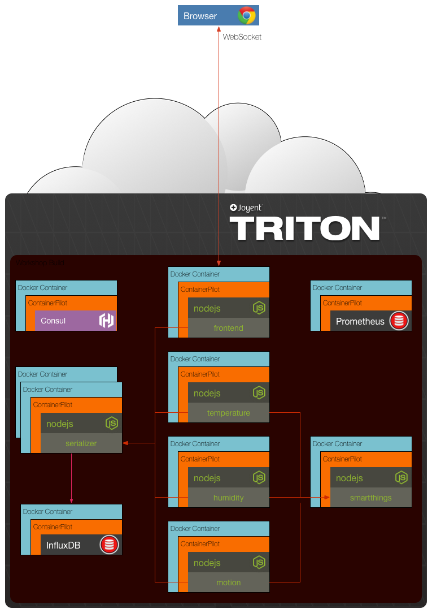

# Node.js Microservices in Containers with ContainerPilot

Example microservices implementation using Node.js and Docker. Below is an architectural diagram depicting the composition of services that make up the project. When everything is working a frontend web application is accessible that will display a set of graphs using sensor data.



## Usage

In local development you can start the microservices by running 

```sh
$ docker-compose -f local-compose.yml up -d
```

Navigate to `http://localhost:10001` in your browser and you will see 3 charts. As data flows into the serializer from the various sensors you will start to see data appear on the charts in real-time.

When deploying to Triton, first setup your environment then run docker-compose. Below is an example of setting your environment variables then pushing the code to production.

```sh
$ ./setup.sh
$ eval $(triton env)
$ docker-compose up -d
```
